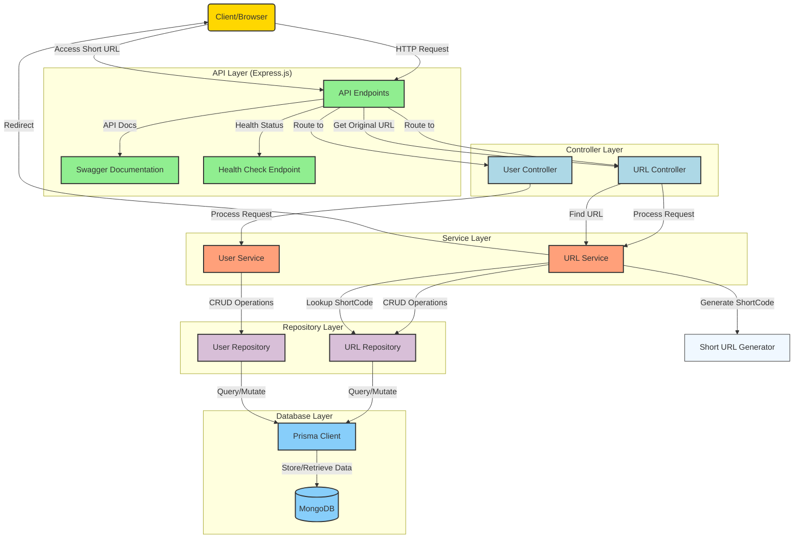

# URL Shortener

A simple, robust, and extensible URL shortening service built with Node.js, Express, and MongoDB. Features RESTful APIs for shortening, managing, and redirecting URLs, plus user management and Swagger API docs.

## Features

- Shorten long URLs to compact, shareable links
- Custom short codes and expiration support
- User management (CRUD)
- MongoDB for persistent storage (via Mongoose ODM)
- Health check endpoints for server and database
- Swagger UI for interactive API documentation

## System Design



## Tech Stack

- Node.js, Express
- MongoDB (via Mongoose ODM)
- Swagger (OpenAPI 3.0)
- NanoID for unique short codes

## Getting Started

### Prerequisites

- Node.js (v16+ recommended)
- MongoDB instance (local or cloud)

### Installation

```bash
git clone https://github.com/Godssidekick1/Docquity.git
cd URL-Shorten
npm install
```

### Environment Variables

Create a `.env` file in the root directory:

```
PORT=8080
DATABASE_URL=mongodb://localhost:27017/urlshorten
NODE_ENV=development
```

### Running the Server

```bash
npm start
```

The server will run on `http://localhost:8080`.

## API Documentation

Interactive docs available at:  
`http://localhost:8080/api-docs`

### Main Endpoints

#### URL Shortening

- `POST /api/shorten`  
  Shorten a new URL.  
  Body: `{ "original_url": "https://example.com" }`

- `GET /api/shorten`  
  List all shortened URLs.

- `GET /api/shorten/:id`  
  Get details for a specific short URL by MongoDB ID.

- `PUT /api/shorten/:id`  
  Update a short URL by ID.

- `PUT /api/shorten/short/:shortCode`  
  Update a short URL by its short code.

- `DELETE /api/shorten/:id`  
  Delete a short URL by ID.

- `DELETE /api/shorten/short/:shortCode`  
  Delete a short URL by its short code.

- `GET /api/shorten/redirect/:shortCode`  
  Redirect to the original URL.

#### User Management

- `POST /api/users`  
  Create a new user.

- `GET /api/users`  
  List all users.

- `GET /api/users/:id`  
  Get user by ID.

- `PUT /api/users/:id`  
  Update user by ID.

- `DELETE /api/users/:id`  
  Delete user by ID.

#### Health Check

- `GET /health`  
  Returns status of server, database, and cache.

## Example Request

```bash
curl -X POST http://localhost:8080/api/shorten \
  -H "Content-Type: application/json" \
  -d '{"original_url": "https://www.google.com"}'
```

## Development

- Project structure follows a clean architecture pattern: routes → controllers → services → repositories → database
- Database operations handled by Prisma ORM, a modern and type-safe ORM for Node.js
- API documentation is auto-generated from JSDoc comments using Swagger

### Prisma ORM Integration

This project uses Mongoose ODM for database operations. Key features include:

- Simple and elegant MongoDB object modeling
- Built-in type casting, validation, query building, and business logic hooks
- Flexible schema definitions with validation
- Rich query API

The database schemas are defined in the `models/` directory:
- `User`: Stores user data with timestamps
- `ShortUrl`: Stores short URLs with their original counterparts and metadata

## License

ISC